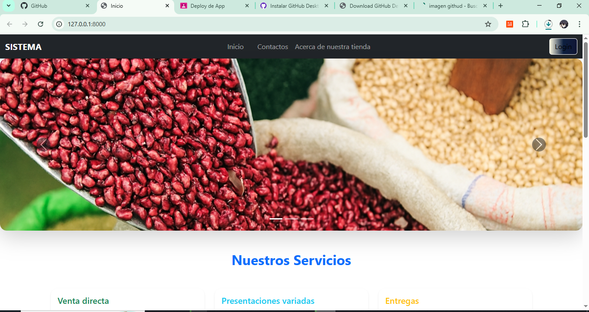

## Instalacion de archivos requeridos

**Crear el entorno virtual: **

Python -m venv venv

**Crear el archivo: **
pip freeze › requirements.txt

**Instalarlo*

pip install -r requirements.txt

## RECURSOS:
Python 3.13.5

microframework web
flask

Gestor de base de datos:
MySq1

## Vistas principal

## Vista de accesos :[alttext](image-1.png)
## Vista dashboard (panel)
[alt text] (image-2.png)